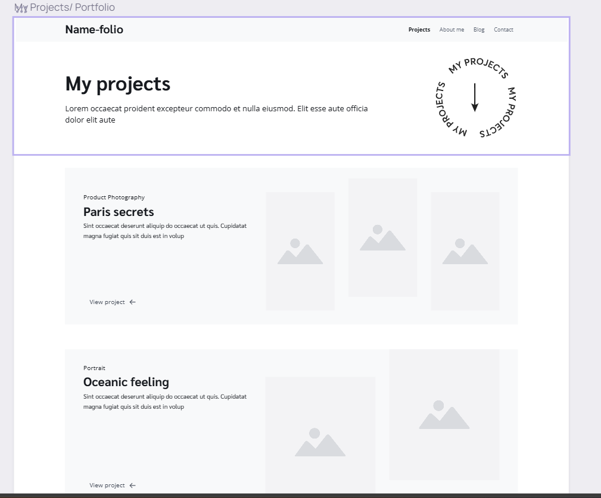
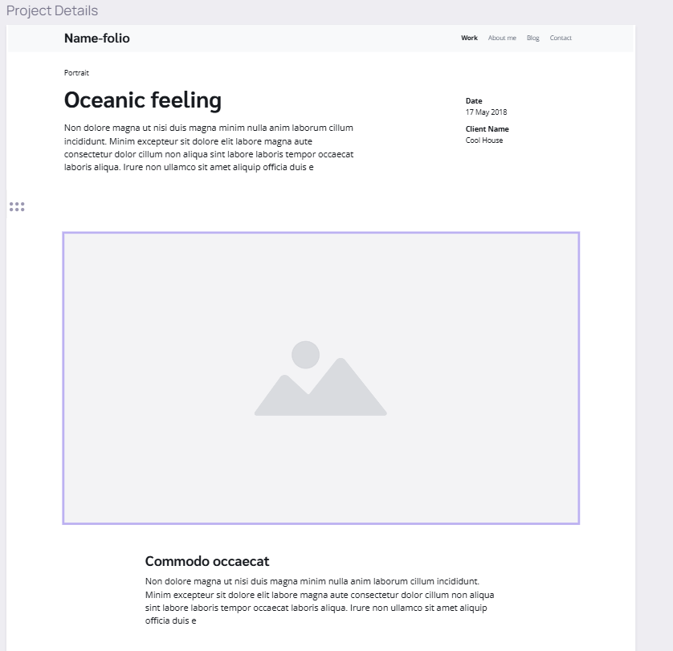
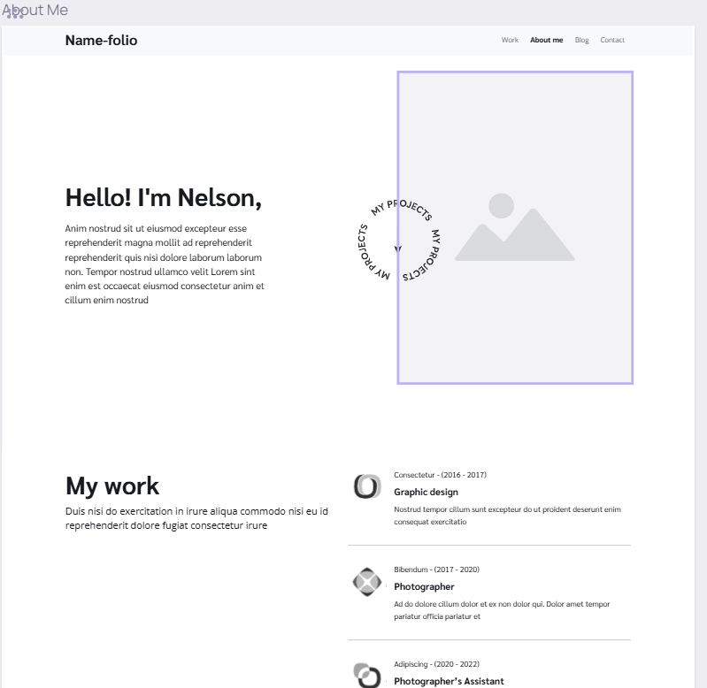
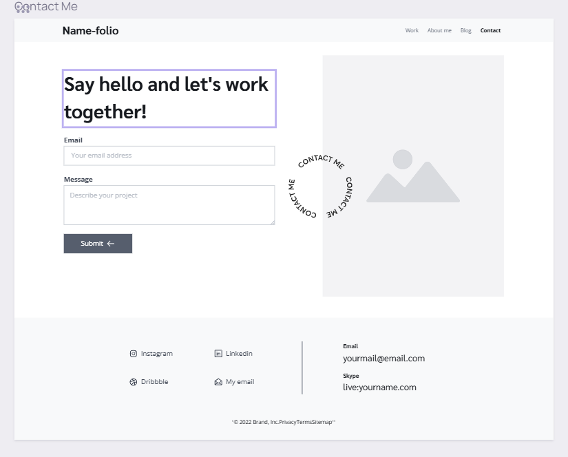

# Diamond Beckom's INF6420 Project

A portfolio website that will display my work thus far.

## Wireframes

I needed inspiration for my portfolio design; therefore this site will show the potential design and architecture. 

Homepage - will include a brief introduction into my work as a student and professional. It will also include my skills.

Projects Tab - Will show a list of the work I have done.

Project Details - Will go into depth about my work once link is clicked on.

About Me - Will go into more detail about who I am. Maybe a few fun facts.

Contact Me - Will include a page for messaging me and my Linkedin will be included.

Footer - Will include copyright information.
